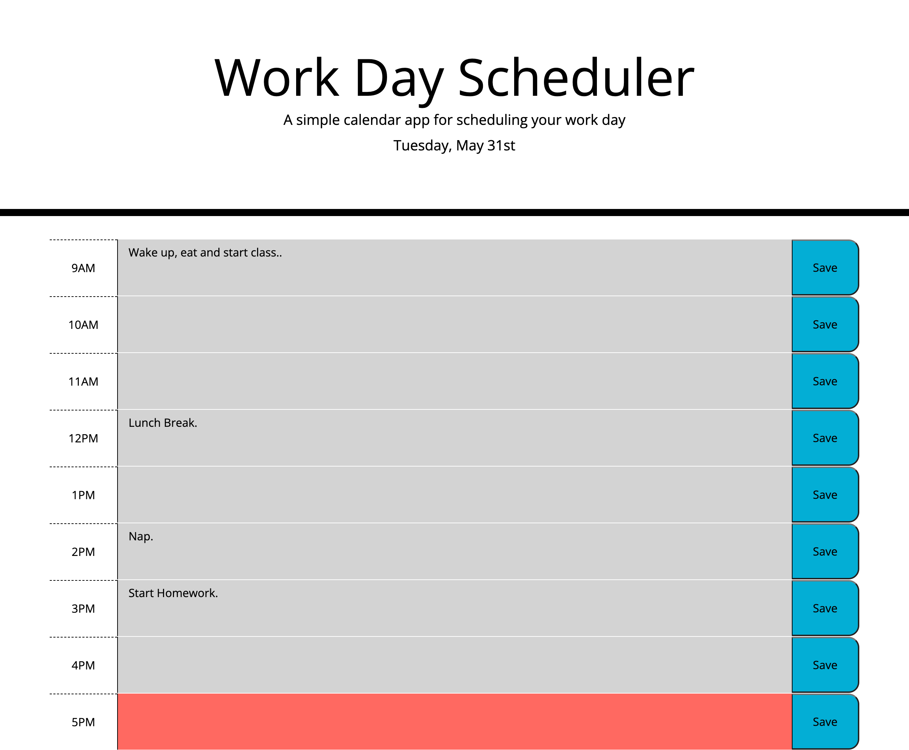

# calendar

## Table of Contents 
1. [Description](#description)
2. [Visuals](#visuals)
3. [Resources](#resources)

## Author:

Safwan Islam

## Description
In this challenge, a workday calendar was created given the parameters. The parameters included color change based on the current time. The current hour is red, past hours gray, future hours green. The current date is also displayed in the format wanted at the top of the page. The user is able to type things into the text box by each hour frame and save their response to local storage. Overall, this allows for the user to create and use a daily work-day calendar.

## Visuals

## Resources
[LIVE SITE](https://saislam10.github.io/calendar/)

[Repository](https://github.com/saislam10/calendar)